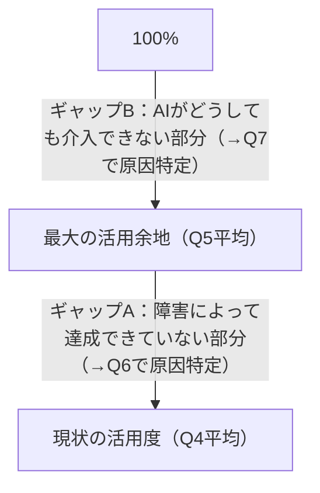
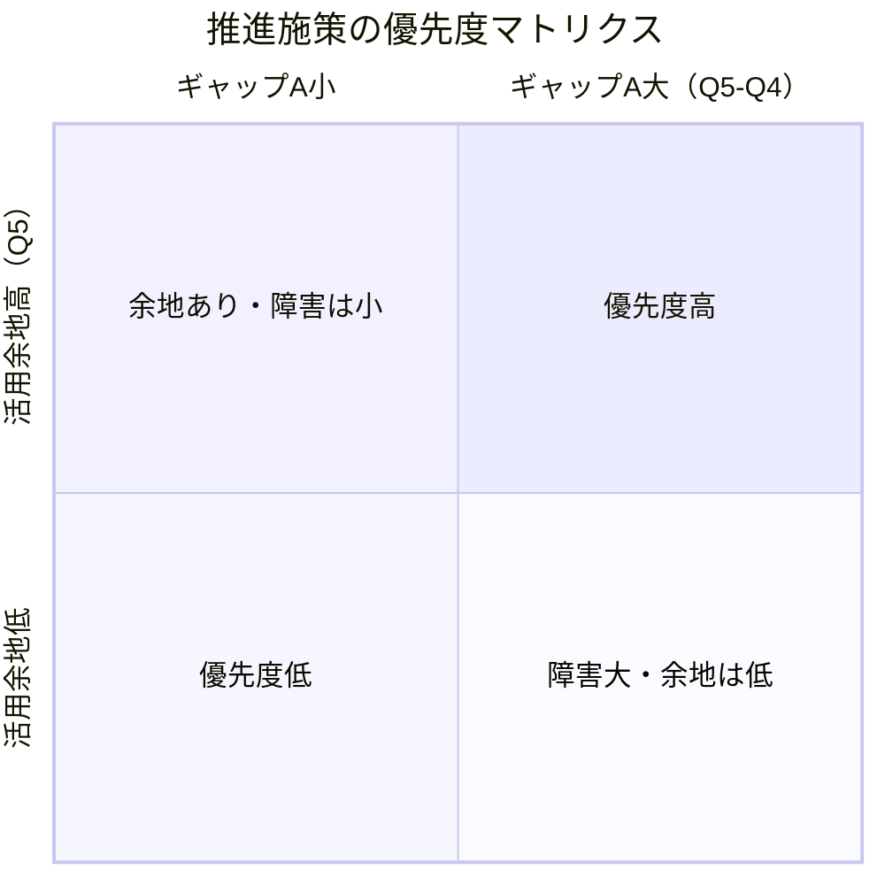
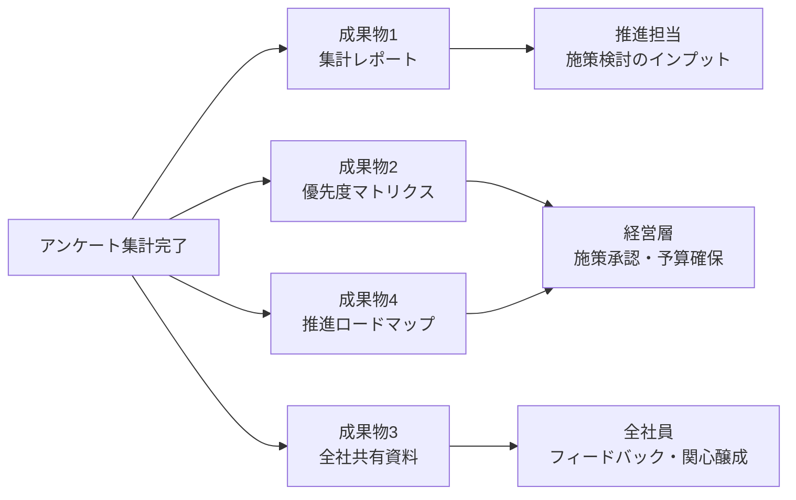
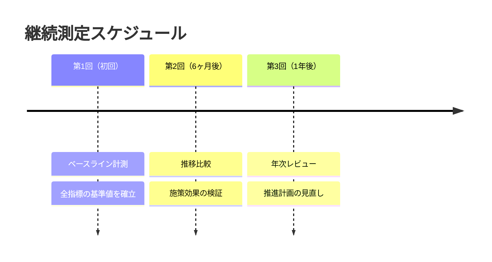

# アンケート分析計画・成果物定義

## 概要

全社AIアンケートの回収後、何を分析し・何を成果物として作成し・誰に何を共有するかを定義する。

---

## 1. 想定される統計・分析

### 1-1. 全社の現状把握

| 分析内容 | 使用設問 | アウトプット例 |
|----------|---------|--------------|
| AI利用率 | Q2 | 「全社員の○%が週1回以上AIを利用している」 |
| ツール普及状況 | Q3 | ツール別の利用者数・利用率ランキング |
| 職種別の利用頻度 | Q1 × Q2 | 開発者vs非開発者の利用頻度比較 |

### 1-2. タスク別の活用状況（コア分析）

アンケートの中心となる分析。Q4・Q5を軸に3層で可視化する。

| 分析内容 | 使用設問 | アウトプット例 |
|----------|---------|--------------|
| タスク別の現状活用度 | Q4 | タスクごとの平均活用度（%） |
| タスク別の最大活用余地 | Q5 | タスクごとの最大活用余地（%） |
| ギャップA（障害による未達） | Q5 - Q4 | 「コード生成は現状50%、最大80% → 30%分が障害」 |
| ギャップB（介入不可） | 100% - Q5 | 「要件定義は最大60% → 40%はAI介入不可」 |
| 職種別比較 | Q1 × Q4/Q5 | 開発者と非開発者で活用度はどう違うか |

### 1-3. 障害・介入不可の分析

| 分析内容 | 使用設問 | アウトプット例 |
|----------|---------|--------------|
| 障害要因ランキング | Q6 | 「スキル不足」が○%で最多、次いで「精度への不安」 |
| 介入不可理由ランキング | Q7 | 「機密情報」が○%で最多 |
| 職種別の障害傾向 | Q1 × Q6 | 開発者は「精度不安」、非開発者は「スキル不足」が多いなど |

### 1-4. 優先度マトリクス

ギャップAが大きい（＝障害で達成できていない）タスクを優先的に推進施策の対象とする。

---

## 2. 成果物一覧

アンケート集計後に作成する成果物。

### 成果物1：集計レポート（内部資料）

- **目的**：推進担当が施策を検討するための詳細データ
- **内容**：
  - 全設問の集計結果（グラフ・表）
  - タスク別 現状/最大/ギャップの一覧
  - 障害・介入不可要因のランキング
  - 職種別クロス集計
- **形式**：スプレッドシート（Google Sheets）

### 成果物2：優先度マトリクス（内部資料）

- **目的**：次フェーズの施策ターゲットを決める
- **内容**：
  - タスクをギャップA × 活用余地でプロット
  - 優先的に取り組むべきタスクの特定
- **形式**：図（スプレッドシート or スライド）

### 成果物3：全社共有資料（社内発表用）

- **目的**：アンケート結果を全社員にフィードバックし、推進への関心・共感を高める
- **内容**：
  - アンケートの目的・背景
  - 主要な発見事項（ハイライト3〜5点）
  - 今後の推進方針（これを受けて何をするか）
- **形式**：スライド（Google Slides）
- **共有タイミング**：集計完了後、全社MTGまたはSlack等で共有

### 成果物4：推進ロードマップ（次フェーズ計画）

- **目的**：アンケート結果を受けた具体的な推進施策の計画
- **内容**：
  - 優先タスク・ターゲット部門の決定
  - 施策案（ツール導入・研修・ユースケース整備など）
  - タイムライン
- **形式**：ドキュメント（本リポジトリに追加）

---

## 3. 共有・報告の設計

---

## 4. 継続測定の設計

半年ごとに同じアンケートを実施し、以下の推移を追跡する。

| 指標 | 初回 | 第2回以降 |
|------|------|----------|
| 全社AI利用率 | ベースライン | 増減を比較 |
| タスク別 現状活用度（Q4平均） | ベースライン | 上昇しているか |
| ギャップA（障害による未達） | ベースライン | 縮小しているか |
| 障害要因ランキング | ベースライン | 解消されているか |

---

## 更新履歴

| 日付 | 内容 |
|------|------|
| 2026-04-22 | 初版作成 |
| 2026-04-22 | ASCII図をMermaid記法に置き換え |
