# アンケート分析計画・成果物定義

## 概要

全社AIアンケートの回収後、何を分析し・何を成果物として作成し・誰に何を共有するかを定義する。

> **注記**：本ドキュメントの図・表内の数値はすべて仮のサンプルデータです。実際のアンケート回収後に実数値に置き換えます。

---

## 1. 想定される統計・分析

### 1-1. 全社の現状把握

**AI利用頻度の分布（全社・50名）**

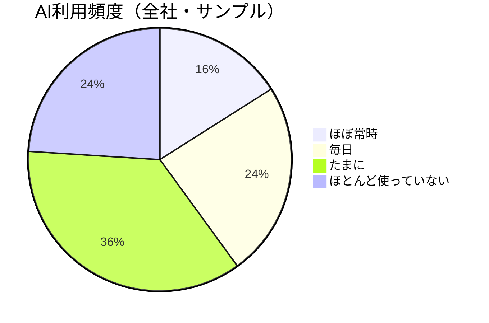

**ツール普及状況**

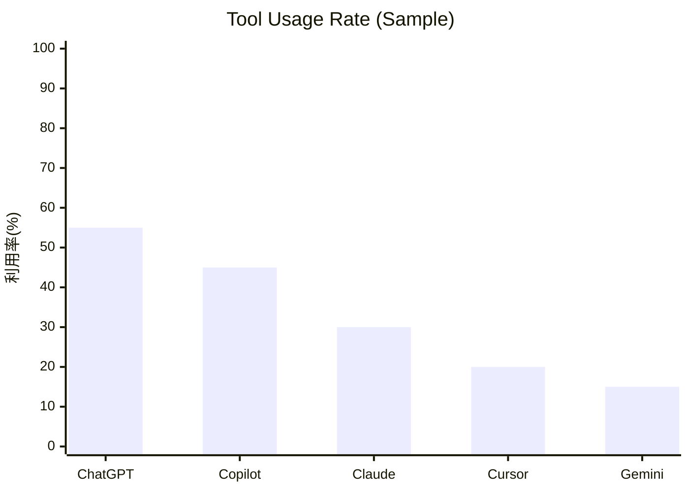

**職種別の利用頻度比較**

| 職種 | ほぼ常時 | 毎日 | たまに | ほとんど使っていない |
|------|---------|------|--------|-------------------|
| 開発者（35名） | 20% | 34% | 31% | 15% |
| 非開発者（15名） | 7% | 13% | 47% | 33% |

---

### 1-2. タスク別の活用状況（コア分析）

アンケートの中心となる分析。Q4・Q5を軸に3層で可視化する。

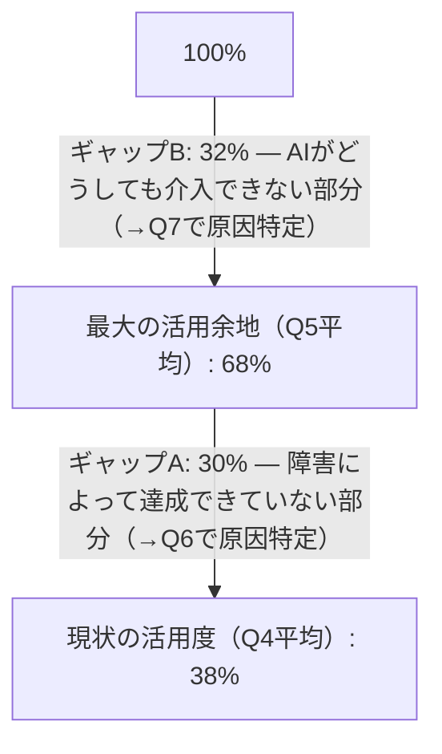

**タスク別 現状(Q4) vs 最大(Q5)**

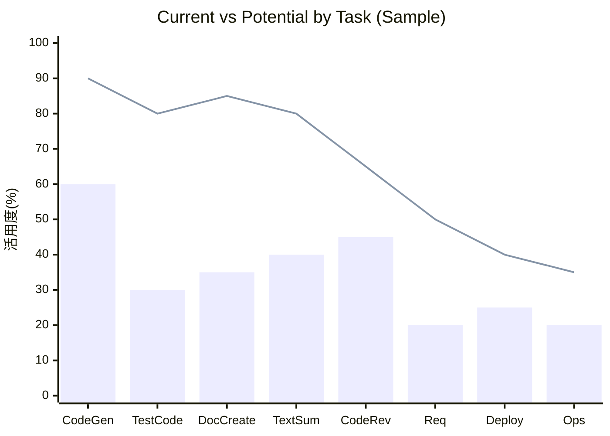

> 棒グラフ = 現状(Q4)、折れ線 = 最大(Q5)

| 分析内容 | 使用設問 | サンプル値 |
|----------|---------|-----------|
| タスク別の現状活用度 | Q4 | コード生成 60%、テストコード生成 30% など |
| タスク別の最大活用余地 | Q5 | コード生成 90%、テストコード生成 80% など |
| ギャップA（障害による未達） | Q5 - Q4 | テストコード生成: 80%-30% = **50%が障害** |
| ギャップB（介入不可） | 100% - Q5 | コード生成: 100%-90% = **10%はAI介入不可** |
| 職種別比較 | Q1 × Q4/Q5 | 開発者平均 Q4:38% / 非開発者平均 Q4:25% |

---

### 1-3. 障害・介入不可の分析

**障害要因ランキング（Q6・複数回答）**

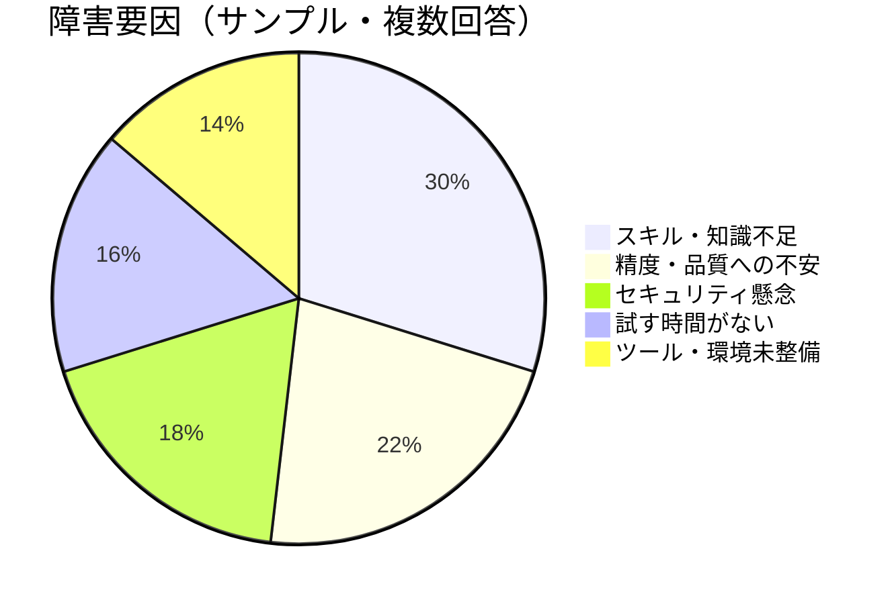

**AI介入不可の理由ランキング（Q7・複数回答）**

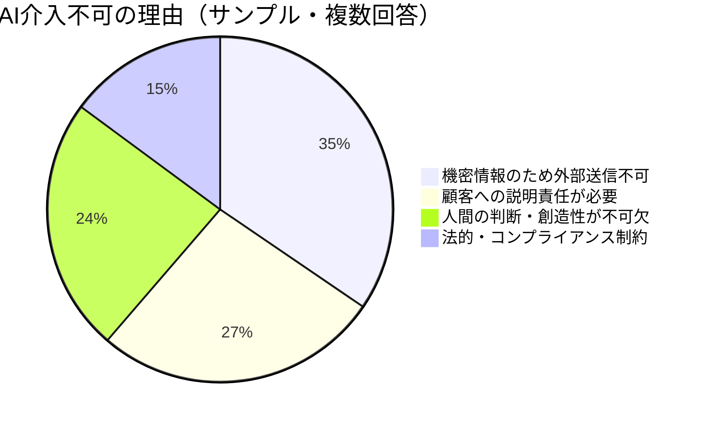

**職種別の障害傾向**

| 障害要因 | 開発者 | 非開発者 |
|---------|--------|---------|
| スキル・知識不足 | 55% | 80% |
| 精度・品質への不安 | 60% | 33% |
| セキュリティ懸念 | 45% | 33% |
| 試す時間がない | 40% | 27% |

---

### 1-4. 優先度マトリクス

ギャップAが大きい（＝障害で達成できていない）タスクを優先的に推進施策の対象とする。

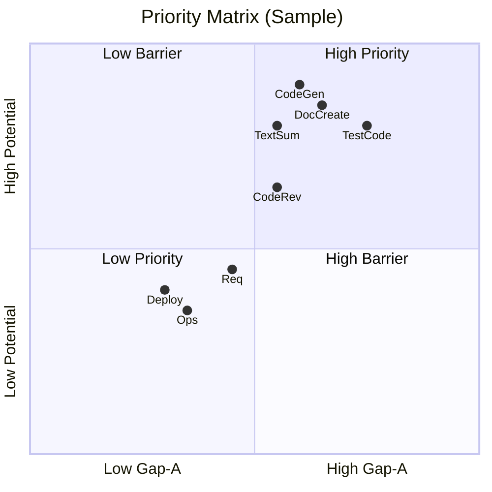

> | 略称 | タスク | 現状(Q4) | 最大(Q5) | Gap-A |
> |------|--------|---------|---------|-------|
> | CodeGen | コード生成 | 60% | 90% | 30% |
> | TestCode | テストコード生成 | 30% | 80% | 50% |
> | DocCreate | ドキュメント作成 | 35% | 85% | 50% |
> | TextSum | テキスト要約・整理 | 40% | 80% | 40% |
> | CodeRev | コードレビュー・デバッグ | 45% | 65% | 20% |
> | Req | 要件定義 | 20% | 50% | 30% |
> | Deploy | デプロイ・リリース | 25% | 40% | 15% |
> | Ops | 運用・保守 | 20% | 35% | 15% |

---

## 2. 成果物一覧

アンケート集計後に作成する成果物。

### 成果物1：集計レポート（内部資料）

- **目的**：推進担当が施策を検討するための詳細データ
- **内容**：
  - 全設問の集計結果（グラフ・表）
  - タスク別 現状/最大/ギャップの一覧
  - 障害・介入不可要因のランキング
  - 職種別クロス集計
- **形式**：スプレッドシート（Google Sheets）

### 成果物2：優先度マトリクス（内部資料）

- **目的**：次フェーズの施策ターゲットを決める
- **内容**：
  - タスクをギャップA × 活用余地でプロット
  - 優先的に取り組むべきタスクの特定
- **形式**：図（スプレッドシート or スライド）

### 成果物3：全社共有資料（社内発表用）

- **目的**：アンケート結果を全社員にフィードバックし、推進への関心・共感を高める
- **内容**：
  - アンケートの目的・背景
  - 主要な発見事項（ハイライト3〜5点）
  - 今後の推進方針（これを受けて何をするか）
- **形式**：スライド（Google Slides）
- **共有タイミング**：集計完了後、全社MTGまたはSlack等で共有

### 成果物4：推進ロードマップ（次フェーズ計画）

- **目的**：アンケート結果を受けた具体的な推進施策の計画
- **内容**：
  - 優先タスク・ターゲット部門の決定
  - 施策案（ツール導入・研修・ユースケース整備など）
  - タイムライン
- **形式**：ドキュメント（本リポジトリに追加）

---

## 3. 共有・報告の設計

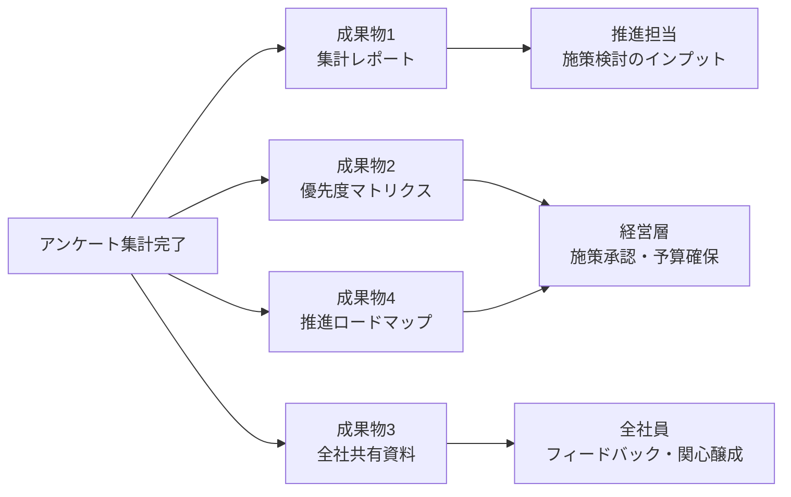

---

## 4. 継続測定の設計

半年ごとに同じアンケートを実施し、以下の推移を追跡する。

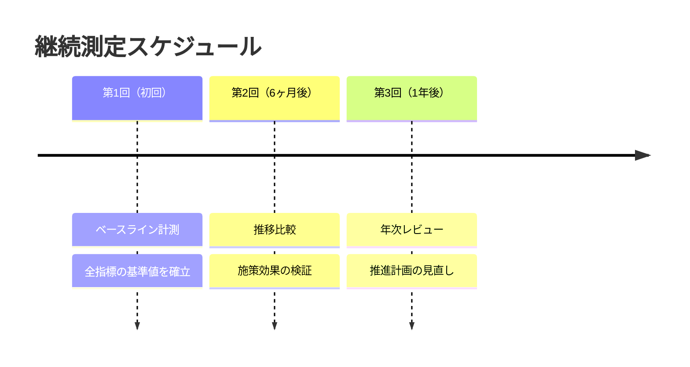

**全社AI利用率の推移（サンプル）**

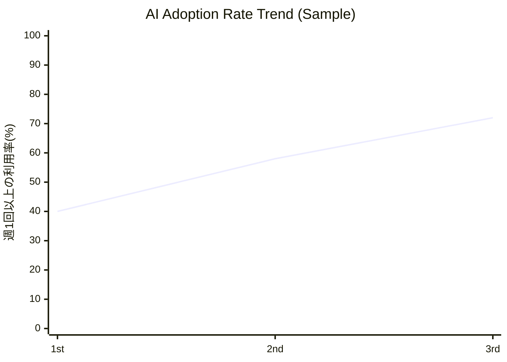

**現状活用度（Q4）と最大活用余地（Q5）の推移（サンプル）**

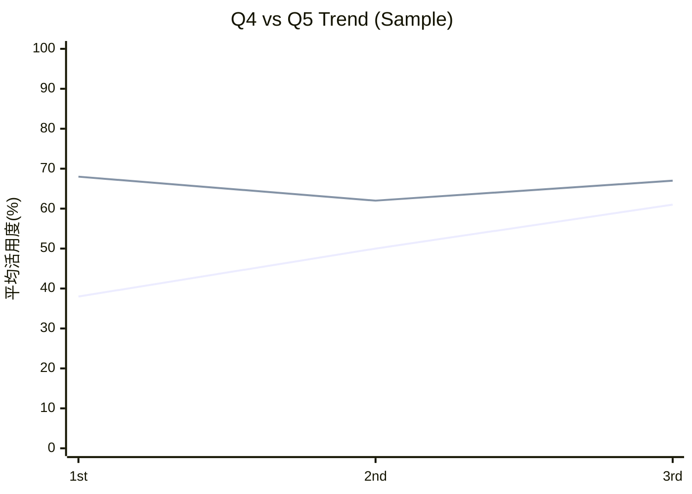

> 1本目 = 現状活用度（Q4）、2本目 = 最大活用余地（Q5）

**Q5（最大活用余地）は固定値ではなく変動する**

Q5は実戦経験を通じて上下にブレることがある。この変動自体が重要な指標。

| パターン | 意味 |
|---------|------|
| Q5が下がる | 「思ったより使えない」—— 過剰期待から現実認識へ（成熟の第一歩） |
| Q5が上がる | 「こんな使い方もできた」—— 新たな活用方法の発見 |
| Q5が下がった後に上がる | AIリテラシーの成熟。正しく理解した上で使いこなせてきたサイン |

**全指標の推移サマリ**

| 指標 | 第1回（初回） | 第2回（6ヶ月後） | 第3回（1年後） |
|------|------------|----------------|--------------|
| 全社AI利用率（週1回以上） | 40% | 58% | 72% |
| タスク別 Q4平均（現状） | 38% | 50% | 61% |
| タスク別 Q5平均（最大余地） | 68% | 62% ↓ | 67% ↑ |
| ギャップA平均（Q5-Q4） | 30% | 12% | 6% |
| 障害要因「スキル不足」 | 65% | 42% | 25% |

---

## 更新履歴

| 日付 | 内容 |
|------|------|
| 2026-04-22 | 初版作成 |
| 2026-04-22 | ASCII図をMermaid記法に置き換え |
| 2026-04-22 | quadrantChartのaxis labelを英語に修正（日本語非対応のため） |
| 2026-04-22 | 全セクションに仮データを追加し分析イメージを可視化 |
| 2026-04-22 | Q5の変動を継続測定に追加、変動パターンの解釈を記載 |
