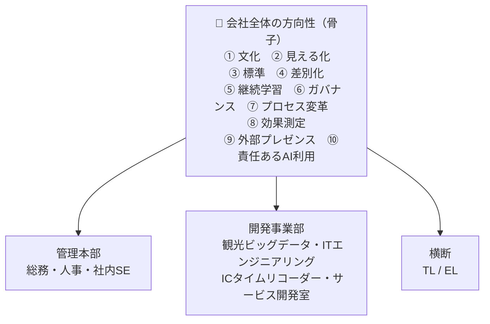
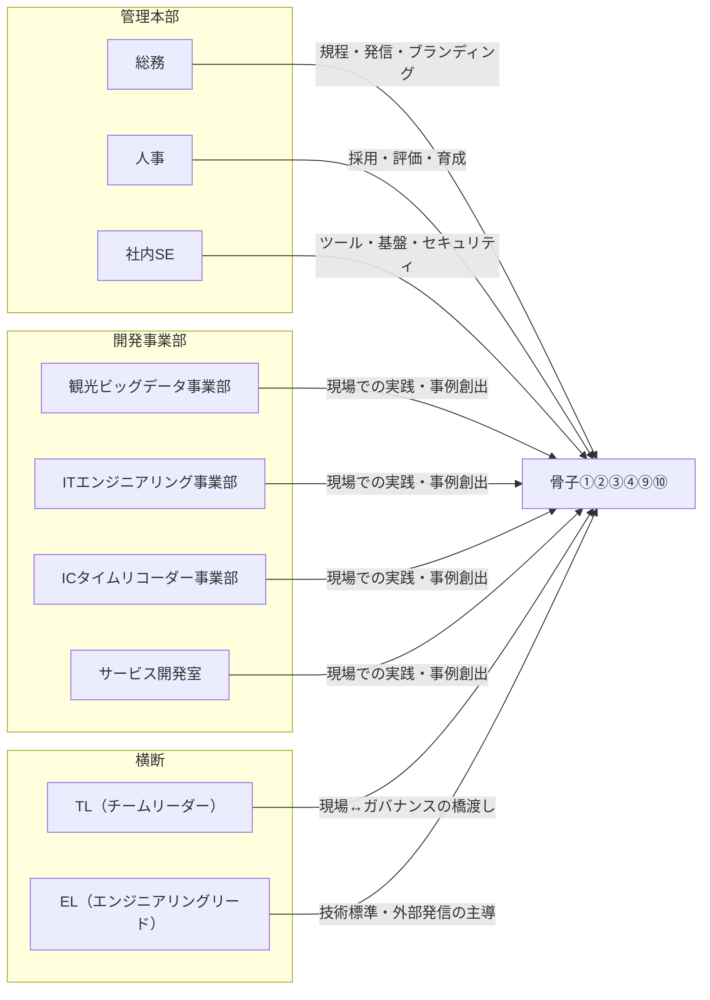

# AI活用推進 骨子・役割定義

**目的：** 会社全体として「AIが使える会社」であることを対外的にアピールできる状態を目指す。
**スコープ：** エンジニアリング部門が主導しつつ、管理本部を含む会社全体へ展開する。

---

## 登場人物

| 区分 | 名称 | 概要 |
|---|---|---|
| 管理本部 | 総務 | 社内規程・ポリシー・対外的な情報発信を担う |
| 管理本部 | 人事 | 採用・評価・教育・組織設計を担う |
| 管理本部 | 社内SE | 社内ITシステム・ツール導入・セキュリティを担う |
| 開発事業部 | 観光ビッグデータ事業部 | 実際のAI活用を実践する現場。顧客向けサービスに直結する |
| 開発事業部 | ITエンジニアリング事業部 | 実際のAI活用を実践する現場。顧客向けサービスに直結する |
| 開発事業部 | ICタイムリコーダー事業部 | 実際のAI活用を実践する現場。顧客向けサービスに直結する |
| 開発事業部 | サービス開発室 | 実際のAI活用を実践する現場。顧客向けサービスに直結する |
| 横断 | TL（チームリーダー） | プロジェクト内でPM/PL的役割を担いつつ、事業部横断でTLとしての方向性を検討・推進する |
| 横断 | EL（エンジニアリングリード） | TLのエンジニアリング版。技術面での横断的な推進・標準化を担う |

---

## 骨子（方向性の柱）

### 1. AI活用を「文化」として根付かせる

AIをツールとして特別視するのではなく、日常業務の自然な選択肢として定着させる。
心理的安全性を確保し、試行錯誤を肯定する組織風土を育てる。

**各Roleの関わり：**

| Role | 関わり方 |
|---|---|
| 総務 | AI活用を奨励する社内規程・行動指針の整備 |
| 人事 | AI活用を評価・育成制度に組み込み、文化形成を制度面から支える |
| 社内SE | 安全に試せる環境・ツールの提供 |
| 事業部 | 現場でのAI活用の実践と、試行錯誤を許容するチーム運営 |
| TL | プロジェクト内でAI活用を推奨し、失敗を学習と捉えるチーム文化を体現する |
| EL | エンジニアリング文化としてのAI活用を定義し、横断的に浸透させる |

**達成状態：**

- 全社員の過半数が週1回以上AIツールを業務で使っている
- 新入社員がオンボーディング中からAIツールを使うことが前提になっている
- 失敗事例を含む「やってみた」報告が週複数件、抵抗なく共有されている
- 「AIを使うか使わないか」を会議で議論しなくなっている

---

### 2. AI活用の成果を「見える化」し、社内外に発信する

活用事例・学び・成果を蓄積し、対外的なアピール材料として整備する。
採用ブランディングや顧客へのアピールにつなげる。

**各Roleの関わり：**

| Role | 関わり方 |
|---|---|
| 総務 | 採用サイト・プレスリリース・SNS等を通じた対外発信の担当 |
| 人事 | 採用活動においてAI活用実績をアピール材料として活用 |
| 社内SE | ツール活用ログや効果測定の仕組みを整備 |
| 事業部 | 事業部内の活用事例を収集・記録し、発信可能な形に整理 |
| TL | プロジェクト単位での成果・学びをまとめ、横展開のきっかけをつくる |
| EL | エンジニアリング観点での技術的成果をドキュメント化し、社外発信（テックブログ等）を主導する |

**達成状態：**

- 活用事例DBに月2件以上の事例が継続的に追加されている
- テックブログ・SNSでのAI関連発信が月1本以上ある
- 採用応募者から「AI活用している会社」として認識されて問い合わせが来ている
- 社内で「あの取り組み、成果どうだった？」と過去事例が参照されている

---

### 3. AI活用の「標準」を定め、品質と安全を担保する

野放図なAI活用ではなく、全社で共通のガイドライン・基準を持つ。
セキュリティ・情報漏洩リスク・品質水準を組織として管理する。

**各Roleの関わり：**

| Role | 関わり方 |
|---|---|
| 総務 | AI利用に関する社内規程・セキュリティポリシーの策定・管理 |
| 人事 | AI関連リスクに関する啓発・研修の実施 |
| 社内SE | 利用可能ツールの選定・承認プロセスの整備、セキュリティ管理 |
| 事業部 | ガイドラインに沿った活用の実践、逸脱リスクの報告 |
| TL | プロジェクト内でのガイドライン遵守を徹底し、判断が必要なケースをEL/管理本部にエスカレーション |
| EL | エンジニアリング向けのAI活用技術基準・コーディングガイドラインを策定・維持 |

**達成状態：**

- AI利用ガイドラインが全社員からアクセスできる場所に存在する
- 新しいAIツール導入時に承認プロセスを経ることが当然になっている
- AIアウトプットのレビューが開発・業務フローに標準で組み込まれている
- セキュリティインシデントがゼロ、またはインシデント発生時に定めたフローで対処できている

---

### 4. AI活用によって「差別化できる」組織になる

単に使っているだけでなく、AIを通じて顧客価値・競争優位性を生み出せる状態を目指す。
外部から見て「あの会社はAIで成果を出している」と認識されることを目標とする。

**各Roleの関わり：**

| Role | 関わり方 |
|---|---|
| 総務 | 対外的なブランドとして「AI活用企業」のポジショニングを担う |
| 人事 | AI活用を強みとする人材の採用・育成に注力 |
| 社内SE | 社内業務のAI化による生産性向上を実現し、成果を示す |
| 事業部 | 顧客へのAIを活用したソリューション提供・提案力の強化 |
| TL | プロジェクトにおけるAI活用の成果を定量的に示し、顧客・社内への説得力を高める |
| EL | 技術的な差別化ポイントを定義し、エンジニアリング組織としての強みを体系化する |

**達成状態：**

- 採用選考で「AI活用環境」が志望動機として複数名から挙がっている
- 顧客提案でAI活用が選定理由になった案件が存在する
- 競合と比較したときにAI活用が優位性として機能したエピソードがある
- 営業資料にAI活用実績が掲載されており、顧客に説明できる

---

### 5. 継続的に「学び、アップデートし続ける」組織をつくる

AI技術は急速に変化する。一度決めたことに固執せず、常に学習・更新できる組織体制を整える。
学習の機会・情報のインプット経路を組織として確保する。

**各Roleの関わり：**

| Role | 関わり方 |
|---|---|
| 総務 | 外部研修・イベント参加に関する制度・予算の整備 |
| 人事 | AI関連スキルを評価・育成制度に反映し、学習を動機づける |
| 社内SE | 新ツール・新技術の評価・PoC環境の提供 |
| 事業部 | 現場での試行結果をフィードバックとして蓄積し、組織学習に貢献 |
| TL | 新しいAI活用手法・ツールをプロジェクトに取り込みながら、横断的に知見を共有する |
| EL | 技術トレンドのキャッチアップを主導し、エンジニアリング組織全体の学習方向性を設定する |

**達成状態：**

- 新しいAIツール・手法について半年以内に評価・採用判断が下されている
- 月次または四半期で技術動向のレビューが実施されている
- 骨子・方針が年1回以上見直され、内容が更新されている
- 「去年と今年でやり方が変わった」事例が各事業部に存在する

---

### 6. 全社横断の「ガバナンス」と推進体制を整える

各部門・事業部が個別に動くのではなく、会社全体として方向性を揃えて推進する。
定期的な連携・情報共有の場を設け、骨子が形骸化しないようにする。

**各Roleの関わり：**

| Role | 関わり方 |
|---|---|
| 総務 | 全社的なAI方針の管理・見直しサイクルの運営 |
| 人事 | 組織横断での人材育成方針の統括 |
| 社内SE | 全社共通のAIツール基盤・セキュリティ基準の維持 |
| 事業部 | 各事業部の状況・ニーズを横断会議に持ち込み、全社方針に反映させる |
| TL | 事業部横断のTL連携を通じて、現場の実態をガバナンス層にフィードバックする |
| EL | エンジニアリング横断のEL連携を通じて、技術的観点からガバナンスの実効性を支える |

**達成状態：**

- 全事業部にAI推進担当（チャンピオン）が存在する
- AI活用状況が四半期ごとに経営層へ報告されている
- 全社AI方針を議論する会議体が存在し、定期開催されている
- 事業部間での方針の齟齬が、横断会議で解消できている

---

### 7. 業務・プロセスを「AIネイティブ」な形に変革する

既存の業務フローにAIを後付けするのではなく、AIがある前提で業務・プロセスそのものを再設計する。
「AIで少し楽になった」ではなく、「AIなしでは考えられない業務設計」を目指す。

**各Roleの関わり：**

| Role | 関わり方 |
|---|---|
| 総務 | 総務・バックオフィス業務のAI前提での再設計（書類処理・問い合わせ対応等） |
| 人事 | 採用・評価・研修プロセスへのAI組み込みを主導 |
| 社内SE | 業務プロセス変革を支えるツール・システムの選定・導入 |
| 事業部 | 開発・運用プロセスをAI前提で見直し、生産性の抜本的な改善を図る |
| TL | プロジェクト運営（進捗管理・ドキュメント・レビュー等）へのAI組み込みを推進 |
| EL | 開発ライフサイクル全体（設計・実装・テスト・レビュー）のAIネイティブ化を定義・推進する |

**達成状態：**

- コードレビュー・テスト・ドキュメント生成がAI前提のフローになっている
- 「AIなしではやっていられない」と言える業務プロセスが各事業部に1つ以上ある
- 新しい業務フローを設計するとき、最初からAI活用が検討されている
- AI導入前と比べて定量的な改善（速度・品質・工数）が出ている

---

### 8. AI活用の「効果・投資対効果」を測定・管理する

AI活用が「やっている感」で終わらないよう、成果を定量的に把握する仕組みを持つ。
測定結果を経営・投資判断に活かし、AI活用への継続的なコミットメントを組織として維持する。

**各Roleの関わり：**

| Role | 関わり方 |
|---|---|
| 総務 | AI活用によるコスト削減・工数削減の測定と報告 |
| 人事 | 採用・育成コストや生産性への影響を測定 |
| 社内SE | ツール導入コストと業務効率化効果の対比測定 |
| 事業部 | 事業部単位でのAI活用による売上・品質・スピードへの貢献を測定 |
| TL | プロジェクト単位での工数削減・品質向上をトラッキングし、報告する |
| EL | エンジニアリング全体の生産性指標（開発速度・品質・障害率等）とAI活用の相関を分析する |

**達成状態：**

- AI活用による工数削減・品質・速度の指標が四半期ごとにレポートされている
- AI投資のROIが経営判断に使われている
- 「効果がなかった」施策も含めて記録・報告できている
- 数値に基づいてAI活用の継続・中止・拡大が判断されている

---

### 9. 外部コミュニティへの「貢献とプレゼンス」を高める

情報発信（骨子2）にとどまらず、外部の技術コミュニティや業界との双方向の関与を持つ。
「発信する会社」から「業界に影響を与える会社」へのポジションシフトを目指す。

**各Roleの関わり：**

| Role | 関わり方 |
|---|---|
| 総務 | 外部イベント・カンファレンス登壇・スポンサーに関する調整・支援 |
| 人事 | 外部コミュニティへの関与を評価・キャリア形成の文脈に位置づける |
| 社内SE | 社内のAI活用事例を外部共有できる形に整理・管理 |
| 事業部 | 顧客・パートナーとのAI共創・共同発表の機会を探索する |
| TL | 外部カンファレンス・勉強会への登壇や情報発信を実践する |
| EL | テックブログ・OSS貢献・カンファレンス登壇など、エンジニアリングブランドの対外構築を主導する |

**達成状態：**

- 年4回以上の外部登壇・発信実績がある
- テックブログの記事が他社・コミュニティから引用・参照されている
- 外部から「AI活用について話を聞かせてほしい」という問い合わせが来ている
- 業界内で自社のAI活用事例が知られている

---

### 10. 「責任あるAI利用」の姿勢を組織として示す

セキュリティ・品質（骨子3）とは別に、AIの倫理的・社会的な側面に向き合う。
AIによる意思決定の透明性・公平性・説明責任を組織として考え、対外的に示す。
「使えるだけ」でなく「正しく使える」会社としての信頼性を獲得する。

**各Roleの関わり：**

| Role | 関わり方 |
|---|---|
| 総務 | AI利用に関する倫理方針・対外声明の策定・公開 |
| 人事 | AI活用における公平性（採用・評価へのAI利用の範囲と制限）を明確化 |
| 社内SE | AIツールの利用範囲・データ取り扱いに関するポリシーの技術的実装 |
| 事業部 | 顧客向けサービスにおけるAI利用の透明性確保・説明責任の実践 |
| TL | プロジェクト内でのAI利用判断において倫理的観点を組み込む |
| EL | AI利用における技術的な公平性・透明性の確保方針を定義し、実装基準に反映する |

**達成状態：**

- AI倫理方針・利用ポリシーが社外公開されている
- 顧客向けサービスでのAI利用範囲・制限が明示されている
- 採用・評価へのAI利用範囲と制限が社内外に明確になっている
- AI起因のトラブル時に対処フローが機能した実績がある

---

## 骨子の関係図（概念）

## 登場人物と骨子の関与マップ

---

## 更新履歴

| 日付 | 内容 |
|---|---|
| 2026-03-25 | 初版作成（骨子6柱・登場人物のRole定義を含む） |
| 2026-03-25 | 骨子4件追加（⑦プロセス変革・⑧効果測定・⑨外部プレゼンス・⑩責任あるAI利用） |
| 2026-03-25 | 各骨子に達成状態を追加 |
| 2026-03-25 | 開発事業部を4部門に再定義（観光ビッグデータ・ITエンジニアリング・ICタイムリコーダー・サービス開発室） |
