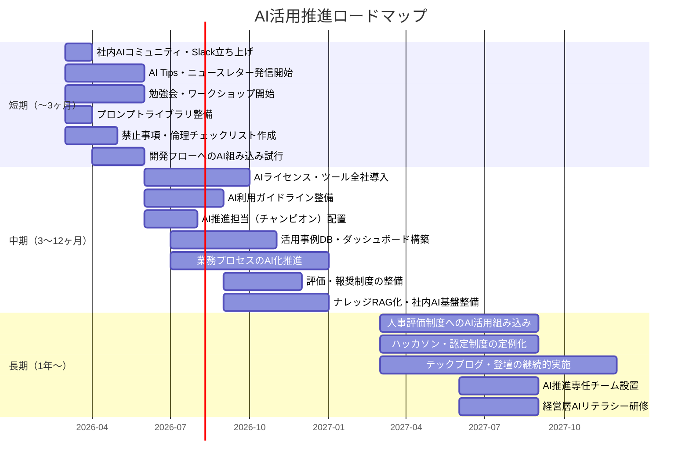

# AI活用推進 ロードマップ

優先度マトリクス（[priority-matrix.md](./priority-matrix.md)）をもとに、手法を時間軸へ落とし込んだものです。

---

## フェーズ定義

| フェーズ | 期間 | 目的 |
|---|---|---|
| 短期 | 〜3ヶ月 | クイックウィン。すぐ着手して成功体験をつくる |
| 中期 | 3〜12ヶ月 | 仕組み・ツール・体制の構築。活用の土台を固める |
| 長期 | 1年〜 | 文化の定着・ガバナンス成熟・対外ブランド確立 |

---

## 短期フェーズ（〜3ヶ月）：クイックウィン

コストと調整が最小で、今すぐ動けるもの。
小さな成功体験を積み重ね、社内の機運を高める。

### 学習・教育

| 手法ID | 手法名 | アクション概要 |
|---|---|---|
| L-01 | 社内勉強会（テーマ別・定期開催） | 月1回以上の定期開催を宣言・スケジュール化 |
| L-02 | ハンズオンワークショップ | まず1回開催してみる |
| L-07 | ペアプロ・モブプロでのAIツール活用実演 | 既存の開発セッションに組み込む |
| L-08 | 社内版「今週のAI Tips」定期発信 | Slackチャンネルで週次発信をスタート |
| L-12 | 「30日AIチャレンジ」等の個人実験プログラム | 参加希望者を募って第1回を実施 |

### ツール・環境整備

| 手法ID | 手法名 | アクション概要 |
|---|---|---|
| T-04 | プロンプトライブラリの整備・共有 | 社内Wikiにプロンプト共有ページを作成 |
| T-11 | 会議の自動文字起こし・議事録生成ツールの導入 | 既存ツール（Teams/Zoom等）の機能を即時有効化 |

### コミュニティ・情報共有

| 手法ID | 手法名 | アクション概要 |
|---|---|---|
| C-01 | 社内AIコミュニティ（Slackチャンネル・定例会） | #ai-adoption チャンネルを開設 |
| C-03 | 失敗事例・学びの共有会 | 月1回の振り返り会をセットアップ |
| C-05 | TL/EL横断での定期レビュー会 | 隔週の定例MTGをスタート |
| C-06 | 社内ニュースレター（AI活用特集） | 月次ニュースレターの配信開始 |
| C-08 | 「AIで何分削減できた」報告チャンネルの運用 | Slackチャンネルを作成・運用ルールを周知 |

### プロセス・業務改善

| 手法ID | 手法名 | アクション概要 |
|---|---|---|
| P-03 | コードレビューへのAI活用の標準化 | レビューにAIを使うことを推奨ルールとして明文化 |
| P-04 | 仕様書・設計書ドラフトのAI生成 | ドラフト生成→人間がレビューのフローを試行 |
| P-05 | テストコード・ドキュメントのAI補完を開発フローに組み込む | 既存フローへの組み込みを各チームで試行 |
| P-07 | 評価コメント・フィードバック作成支援 | 評価シーズンに向けてAI活用を案内 |
| P-09 | 顧客向け提案書・見積のAI下書き生成 | 営業・提案フローで試行 |
| P-10 | スプリントレビュー・振り返りへのAI活用 | 次のスプリントから組み込む |
| P-13 | 競合・市場調査のAI自動化 | 調査業務でAIを使うフローを試行 |

### ガバナンス・標準化

| 手法ID | 手法名 | アクション概要 |
|---|---|---|
| G-02 | 禁止事項・リスク分類表の作成 | 最低限のNG事項リストをまず作成・共有 |
| G-07 | 倫理チェックリストの作成・運用 | シンプルなチェックリストをドラフト |

### 対外発信・ブランディング

| 手法ID | 手法名 | アクション概要 |
|---|---|---|
| B-03 | SNS（X/Zenn/note 等）での個人発信の奨励・支援 | 発信を奨励するアナウンス＋簡単なガイドラインを周知 |
| B-05 | 採用サイトへのAI活用実績の記載 | 採用サイトの更新を総務・人事に依頼 |
| BZ-04 | AI活用を訴求した営業資料・事例集の整備 | 既存事例をまとめた資料を1本作成 |

---

## 中期フェーズ（3〜12ヶ月）：仕組み・ツール・体制の構築

基盤となる仕組み・ツール・体制を整備する。活用の「当たり前化」を目指す。

### 学習・教育

| 手法ID | 手法名 |
|---|---|
| L-06 | オンボーディングへのAI基礎研修の組み込み |
| L-11 | ロール別学習パスの整備 |
| L-13 | 社内AIメンター制度 |

### ツール・環境整備

| 手法ID | 手法名 |
|---|---|
| T-01 | GitHub Copilot / Cursor 等の開発支援AIの全員導入 |
| T-02 | ChatGPT / Claude 等の業務利用ライセンス整備 |
| T-03 | AI利用専用のサンドボックス環境の提供 |
| T-07 | CI/CDへのAIコードレビューの組み込み |
| T-08 | ドキュメント自動生成パイプラインの整備 |
| T-09 | テスト自動生成ツールの導入 |
| T-10 | AI利用ログ・利用状況の可視化ダッシュボード |
| T-12 | 社内ナレッジのRAG化 |

### コミュニティ・情報共有

| 手法ID | 手法名 |
|---|---|
| C-02 | 活用事例データベースの構築 |
| C-04 | 部門をまたいだAI活用事例発表会 |
| C-07 | 活用事例の社内表彰・シェアアウト |

### プロセス・業務改善

| 手法ID | 手法名 |
|---|---|
| P-01 | 定型業務のAI自動化（議事録・週次レポート等） |
| P-02 | 社内問い合わせ対応のAIチャットボット化 |
| P-08 | 障害対応・ポストモーテムのAI補助 |
| P-11 | 顧客フィードバック・問い合わせのAI分析 |
| P-12 | 契約書・法務文書のAIレビュー支援 |

### 評価・インセンティブ

| 手法ID | 手法名 |
|---|---|
| E-02 | AI活用による工数削減を定量的にトラッキング |
| E-03 | 優れた活用事例への報奨制度 |
| E-05 | 個人のAI習熟度の可視化・目標設定 |

### ガバナンス・標準化

| 手法ID | 手法名 |
|---|---|
| G-01 | AI利用ガイドライン・社内規程の整備 |
| G-03 | ツール承認プロセスの整備 |
| G-04 | AIアウトプットのレビュープロセスの標準化 |
| G-05 | データ取り扱い・個人情報ポリシーのAI対応版整備 |
| G-06 | AI利用に関するインシデント報告フローの整備 |

### 対外発信・ブランディング

| 手法ID | 手法名 |
|---|---|
| B-06 | 顧客・パートナーへの活用事例の共有 |

### 組織・体制

| 手法ID | 手法名 |
|---|---|
| O-02 | AI推進ロードマップの策定・公開 |
| O-03 | 各事業部にAI推進担当（チャンピオン）を置く |
| O-04 | 定期的な骨子・方針の見直しサイクルの運営 |

### データ・AI基盤

| 手法ID | 手法名 |
|---|---|
| D-01 | 社内データカタログの整備 |
| D-04 | AIモデルの評価・選定フレームワークの整備 |

### 顧客・ビジネス展開

| 手法ID | 手法名 |
|---|---|
| BZ-01 | 顧客向けAIデモ・PoC環境の整備 |
| BZ-02 | AI活用を前提とした見積・提案プロセスの再設計 |

---

## 長期フェーズ（1年〜）：文化の定着・ガバナンス成熟・対外ブランド確立

仕組みを活かして文化・ブランド・評価制度として定着させる。

### 学習・教育

| 手法ID | 手法名 |
|---|---|
| L-03 | 社内AIチャレンジ・ハッカソン（定例化） |
| L-05 | 社内認定制度（AIスキルバッジ等） |

### ツール・環境整備

| 手法ID | 手法名 |
|---|---|
| T-05 | MCPサーバーの社内構築・展開 |

### 評価・インセンティブ

| 手法ID | 手法名 |
|---|---|
| E-01 | AI活用度を評価項目に追加（人事制度改定） |

### 対外発信・ブランディング

| 手法ID | 手法名 |
|---|---|
| B-01 | テックブログへのAI活用事例記事の投稿（継続的） |
| B-02 | カンファレンス・勉強会への登壇（継続的） |

### 組織・体制

| 手法ID | 手法名 |
|---|---|
| O-01 | AI推進専任チームまたはギルドの設置 |
| O-06 | 経営層へのAIリテラシー研修の実施 |

---

## タイムライン概要

---

## 更新履歴

| 日付 | 内容 |
|---|---|
| 2026-03-25 | 初版作成（短期24手法・中期33手法・長期8手法） |
